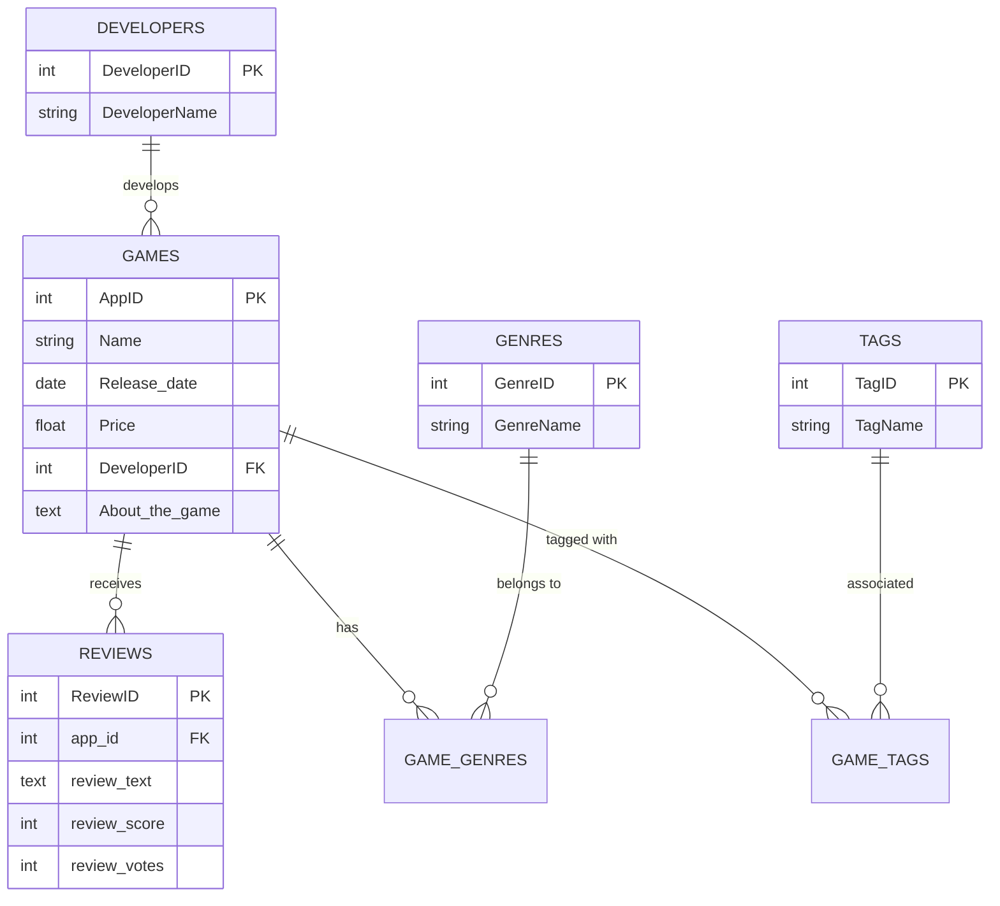

# Milestone 1: Project Proposal and Dataset V1 - Steam Nexus

## 1. Project Statement

**Domain:** Digital Entertainment and Video Games (Steam Ecosystem).

**Problem:** This project is framed within the domain of digital entertainment, specifically in the video game ecosystem of the Steam platform. This environment is characterized by its large volume of content, with over 100,000 available titles, creating a complex scenario for user decision-making.

In this context, the main problem identified is "analysis paralysis," a phenomenon that occurs when users face an overload of options and information, delaying or even blocking decision-making. This behavior is often associated with the need to evaluate too many alternatives, the fear of making an incorrect decision, and the difficulty of comparing multiple variables simultaneously, which negatively impacts the user experience (Boogaard, 2024).

Furthermore, traditional recommendation systems, while aiming to help users find relevant content in a personalized way, have significant limitations. In particular, the existence of popularity bias has been evidenced, where algorithms tend to predominantly recommend the most popular items in the catalog, reducing the exposure of those belonging to the "long tail." This behavior not only limits the diversity and value of recommendations for users but can also generate feedback effects that reinforce the popularity of certain items over time (Klimashevskaia et al., 2024).

**Product Question:** Based on this problem, the following product question is posed: Is it possible to discover latent video game segments and predict the success of new genre combinations using graph intelligence techniques and natural language processing?

**Suitability for the course:** The suitability of this project for the course lies in the massive and complex nature of the Steam dataset, which allows addressing multiple stages of data analysis. These include the ingestion of metadata and user reviews, feature engineering using natural language processing techniques applied to textual descriptions (and potentially audio analysis in trailers), hybrid genre clustering, and the development of graph-based recommendation systems modeling co-occurrence relationships between tags.

## 2. Source Inventory

- **Name:** Steam Games & Reviews Dataset (2024).
- **Origin:** [Kaggle - Games](https://www.kaggle.com/datasets/fronkongames/steam-games-dataset) and [Kaggle - Reviews](https://www.kaggle.com/datasets/andrewmvd/steam-reviews).
- **License:** MIT and CC BY-NC-SA 4.0.
- **Format:** CSV.
- **Estimated Size:** ~123,000 games and >6.4M reviews (~2GB+ total).

## 3. Draft Schema

The schema design follows a normalized relational model to facilitate graph analysis and natural language processing (NLP).

### Entity-Relationship Diagram (ERD)


### Entities and Keys
1. **GAMES (Master):** Contains basic technical and commercial information for each title.
2. **REVIEWS (Transactional):** Stores the user experience. It is the source for sentiment analysis (NLP).
3. **DEVELOPERS (Master):** Allows for analyzing the historical performance of development companies.
4. **GENRES & TAGS (Attributes):** Normalized entities to avoid redundancy and allow for clustering analysis.

### Joins and Business Value

To resolve the product question, the following strategic Joins will be executed:

| Operation | Keys | Business Problem it Solves |
| :--- | :--- | :--- |
| **GAMES ⨝ REVIEWS** | `AppID = app_id` | **Satisfaction Analysis by Price:** Allows identifying if more expensive games actually have better reviews or if there is a price "bubble" in certain genres. |
| **GAMES ⨝ TAGS** | `AppID = AppID` | **Niche Discovery (Co-occurrence):** By joining games with their tags, we can create a graph that recommends games sharing similar "vibes" or "mechanics," not just generic genres. |
| **GAMES ⨝ DEVELOPERS**| `DevID = DevID` | **Risk Prediction:** Evaluates if a new developer attempting a hybrid genre has a probability of success based on the history of other similar developers. |
| **GAMES ⨝ GENRES** | `AppID = AppID` | **Hybrid Clustering:** Necessary cross-reference to detect underrepresented genre combinations that could be market opportunities. |

## 4. Processed Dataset V1

The ingestion, auditing, and deep cleaning phase of the master games dataset has been completed. The process is automated through a production script and documented in the analysis notebook.

**Processing Evidence:**
- **Clean Table (Disk):** `data/processed/steam_games_cleaned_v1.csv`
- **Automation Script:** `src/data_cleaning.py`
- **Auditing Notebook:** `notebooks/01_data_exploration_and_cleaning_v1.ipynb`

**Summary of Cleaning V1:**
- **Structure Correction:** Resolved the column shift from the original CSV (40 real columns vs 39 expected).
- **Referential Integrity:** Removal of records with duplicate `AppID` or null names.
- **Type Normalization:** Conversion of `Price`, `Positive`, and `Negative` to standardized numerical formats.
- **Textual Sanitization:** Normalization of `Name` (Title Case) and categorical fields (`Genres`, `Tags`, `Developers`) to lowercase to facilitate clustering.
- **Total processed records:** 122,610 games ready for analysis.

## 5. Data Dictionary Draft

| Column | Type | Description |
| :--- | :--- | :--- |
| `AppID` | Integer | Primary Key. Unique identifier for the application on Steam. |
| `Name` | String | Official video game name (Sanitized in Title Case). |
| `Price` | Float | Current selling price in USD. (0.0 indicates Free-to-play). |
| `Genres` | String (List) | Thematic categories (e.g., action, indie). Normalized to lowercase. |
| `Tags` | String (List) | Community-defined tags for co-occurrence analysis. |
| `Positive` | Integer | Total number of positive reviews received. |
| `Negative` | Integer | Total number of negative reviews received. |
| `Release date` | Date | Official release date in YYYY-MM-DD format. |
| `About the game` | Text | Detailed game description for content analysis (NLP). |
| `Developers` | String | Company or group responsible for developing the title. |

## 6. Scale Analysis

Following the V1 processing, a technical audit has been performed to quantify the magnitude of the data ready for modeling.

### Magnitude Metrics (Processed Dataset)
- **Record Volume:** 122,610 rows.
- **Attribute Dimension:** 10 selected columns.
- **Missing Data:** 0% in critical variables (AppID, Price, Genres). A tiny 0.002% of remaining null names was detected after ingestion (3 records).
- **Memory Usage:** ~52.38 MB in RAM (Deep introspection).

### Estimation and Audit Code
```python
import pandas as pd

# Load processed dataset
df = pd.read_csv('data/processed/steam_games_cleaned_v1.csv')

# Count rows and columns
print(f"Rows: {len(df)}")
print(f"Columns: {len(df.columns)}")

# Null data audit
print(df.isnull().sum())

# Real memory estimation
mem_usage = df.memory_usage(deep=True).sum() / (1024**2)
print(f"Memory Usage: {mem_usage:.2f} MB")
```

**Audit Result:**
The processed games dataset is highly memory-efficient (~52 MB) and has 99.99% integrity in its key fields, ensuring a solid foundation for the analysis and modeling stages of Milestone 1.

## 7. Ethics and Access Note

The development of *Steam Nexus* is guided by principles of transparency and respect for data privacy:
- **Transparency in Origin:** Data comes from public repositories on Kaggle, which were collected using the official Steam WebAPI according to its terms of service.
- **Privacy and Anonymization:** The dataset does not contain real names, email addresses, or contact information of users. Anonymous numerical identifiers are used for reviews, ensuring that re-identification of individuals is not possible.
- **Copyright:** Valve Corporation's intellectual property over game metadata is recognized. The use of this dataset is strictly academic and non-profit.
- **Integrity:** The documented cleaning process ensures that results do not introduce artificial biases that alter market perception.

---

## 8. Technical Expectation: Pipeline Execution

To meet the reproducibility requirement, the data ingestion and cleaning have been consolidated into production scripts.

### 8.1 Data Ingestion (Automated)
To download the raw data directly from Kaggle and place it in the correct directory:

1. Configure your `.env` file with `KAGGLE_USERNAME` and `KAGGLE_KEY`.
2. Run the ingestion script:
```powershell
python src/ingestion.py
```
**Effect:** Downloads and renames `steam_games_raw.csv` and `steam_reviews_raw.csv` into `data/raw/`.

### 8.2 Data Cleaning
Once the raw data is present, run the cleaning pipeline:

```powershell
python src/data_cleaning.py
```

**Technical Parameters:**
- **Input:** `data/raw/steam_games_raw.csv`
- **Output:** `data/processed/steam_games_cleaned_v1.csv`
- **Dependencies:** See `requirements.txt` (Pandas, Numpy, Kaggle, python-dotenv).

Boogaard, K. (2024). How to get unstuck: tips for moving past analysis paralysis. Work Life by Atlassian. https://www.atlassian.com/blog/productivity/analysis-paralysis

Klimashevskaia, A., Jannach, D., Elahi, M., & Trattner, C. (2024). A survey on popularity bias in recommender systems. User Modeling and User-Adapted Interaction, 34(5), 1777–1834. https://doi.org/10.1007/s11257-024-09406-0
